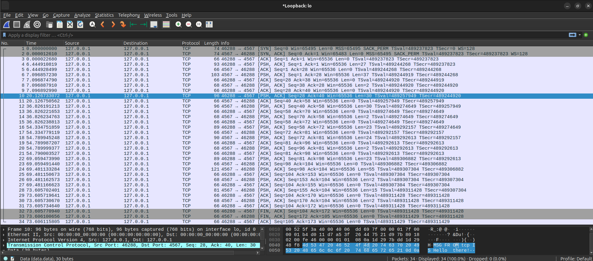
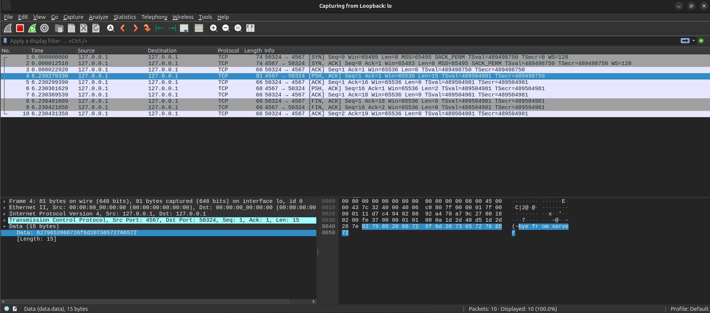
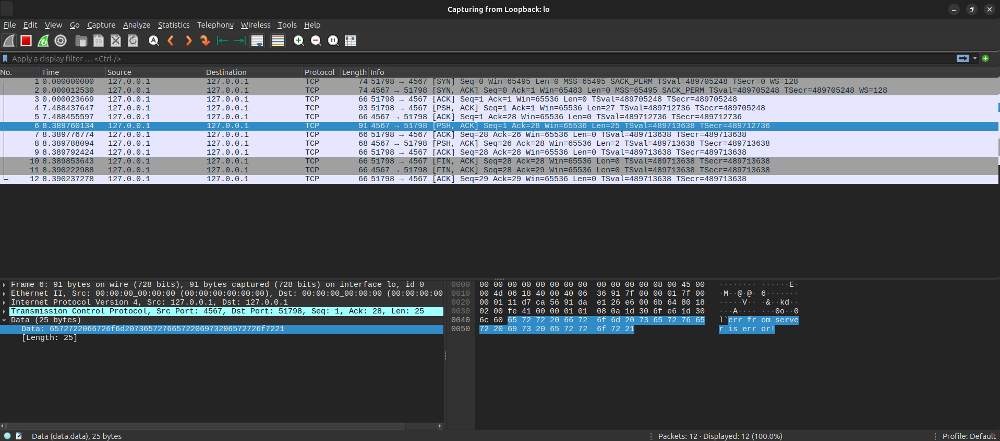

# IPK Project 2: Client for a chat server

### Introduction
Simple client for a chat server using the IPK25-CHAT protocol, built on top of the TCP and UDP transport protocols.

The client only uses a **single**, **chosen** transport protocol at a time.

#### Author
- Marek Pazúr (xpazurm00)

When writing the documentation, the [Google translate](https://translate.google.com/) tool was used to better formulate sentences and select more precise terms to increase the quality of the documentation.

### Content structure

- [Theory](#theory)
  - [TCP](#tcp)
  - [UDP](#udp)
- [Implementation details](#implementation-details)
  - [Architecture](#architecture)
  - [Class diagram](#class-diagram)
  - [Finite state machine](#finite-state-machine)
  - [Implementation](#implementation)
    - [Client](#client)
    - [I/O handling](#io-handling)
    - [Protocol](#protocol)
- [Testing](#testing)
- [License](#license)
- [Bibliography](#bibliography)

## Theory

#### TCP
TCP is a *connection-oriented*, *reliable in-order byte stream transport protocol*, placed directly above the *Internet Protocol layer* in the TCP/IP stack. [3, section 1.1]

When TCP is selected as the transport protocol, application layer data is sent over the network as a *sequence of bytes (in order)* via TCP segments.

Each such TCP segment contains a *sequence number* and a so called *checksum*, which is a checksum of two-byte words that ensures data integrity. [4]

The segment also contains a field with key flags:

- SYN (Synchronize) - a request to start communication and synchronize sequence numbers

- RST (Reset) - termination of the connection, or signaling an error in communication, or a closed port

- ACK (Acknowledge) - confirmation of message delivery

- PSH (Push) - immediate delivery of data without delay to the application layer

The segment *sequence number* allows you to detect and prevent packet loss, the *ACK flag* ensures possible *retransmission* if the sent packet was **not** acknowledged on the sender's side of the communication. [4]

In the context of this project, it is worth mentioning that TCP uses port numbers provided by the IP layer header to **multiplex** communication with multiple hosts, unlike UDP. [3], [4]

If a packet larger than the Ethernet layer MTU, which is approximately 1500 bytes, is sent, *packet loss* or packet *fragmentation* could occur.

*Fragmentation* means that a message can arrive in multiple packets, so the application layer on the receiving side will have to combine the contents of the packets into the resulting complete message.

*Similar issue* can occur with TCP *segmentation*, which means that the data sent by an application may not exactly match how it will be sent over the network. TCP may break the sender's message into smaller messages and send it in parts to optimize interactions between layers. [4, section 3.7]

Another potential challenge for the receiving application layer can be the coalescing of message contents into a single packet. This is caused by the so-called *Nagle Algorithm*, which was created to reduce the overhead, which would be unnecessarily high in the case of a large number of small packets. In short, if the sender has unacknowledged data, the data that it has designated for sending is buffered regardless of the PSH flag. [4, section 3.7.4]

#### UDP
The UDP protocol is a transport protocol, located just like the aforementioned TCP *above* the IP layer. It provides a very simple procedure for the application layer of a program, which allows sending data to other programs/devices within the network. [5]

The UDP protocol segment is very simple, containing only 4 fields:
- Source port
- Destination port
- Length - size of the UDP segment (including data) in bytes
- Checksum - a checksum of 2 byte words, used to ensure data integrity

Due to its simplicity, it does **not** guarantee responsible packet delivery, unlike TCP. Normally it is not considered to be a suitable protocol for chat applications.

The protocol's problems include:
- Packet loss - since there is no confirmation of receipt.
- Packet misorder - there is no message marking that would allow the sequence of received messages.

To address these issues, the project's application protocol uses pseudo-TCP mechanisms, such as *message acknowledgements* or unique message *identification numbers*. This prevents packet loss, packet duplication, and delays.

## Implementation details

### Architecture

The main goal of the design was a *layered architecture*, where the individual, key components of the program are stacked on top of each other and communicate with each other.


This will make it possible to very easily expand the structure of the program with additional components (or replace the already existing ones).

For an example, expanding the structure with another transport protocol, or with a component processing input/output operations.

### Class diagram

The **Command** and **Abstract Factory** design patterns were used in the design of the classes. [1], [2]


*Note:*
To better understand the diagram
- Green color indicates class
- Red color indicates structure
- Blue color indicates interface or abstract class

### Finite state machine

A simple finite state machine, illustrating client control based on the type of messages sent or received.


### Implementation

#### Client

The entry point of the client program is the `client_run` instance method of the `Client` class object, which also serves as the core of the client. It handles processing input/output operations and sending or receiving messages from the server side.

The body of the method contains a while loop that repeatedly uses the `poll` function to monitor certain activities (`POLLIN`, `POLLHUP`) on two file descriptors.

The file descriptors are the standard input (`STDIN`) and a *non-blocking network* socket whose type corresponds to the selected transport protocol, which is either TCP or UDP.

This allows the program to respond to both user commands and incoming network data without blocking or constantly checking each source (*active waiting*), which is very uneffective and cpu consuming.

#### I/O handling

As soon as input data terminated by a `'\n'` (newline) character is prepared on `STDIN`, the entire line is read and then parsed in the static `get_command` method of the `Command` class.

The `get_command` method returns a concrete `Command` type instance, which has an `execute` method that will perform the corresponding operations of the given command. Such as changing the client's state, or sending a message and possibly waiting for a reply. [1]

The command itself **can represent a state of the FSM**. In particular, the `AUTH`, `JOIN` commands, where after sending a message in the form of a request to the server, a `REPLY` response is **expected**, in the case of UDP additionally a `CONFIRM` message.

Until the response (confirmation) *arrives*, it is **not** possible to exit this state. In other words, it is **not possible** to perform any further operations, **until** the commands completion.

All messages received from the server are processed, including any possible output of their contents to standard output (`STDOUT`), in the already mentioned `client_run` method.

The `client_output` method is used to output the contents of server messages, and the `local_error` method is used to output local error messages.

#### Protocol

The protocol within this program covers both the `IPK25-CHAT` application protocol and *TCP/UDP* transport protocols in an abstract class.

The class `protocol` itself contains a set of virtual methods intended for specific classes of transport protocols to be overridden.

Such methods intended for communication are:
- `connect()` - used to *connect* the client to the server, **if** the transport protocol allows it
- `send()` - sending a message of any type from the client
- `receive()` - receiving a message of any type from the server into the buffer
- `process()` - **preprocessing** the message corresponding to the respective transport protocol. Each has a different defined format for the content of the messages.
- `error()` - sending an `ERR` message to the server that an error has occurred (for example, a malformed message)
- `disconnect()` - disconnecting from the server, i.e. sending a `BYE` message

The rest of the methods are generally useful methods that can be used independently of the chosen transport protocol, but the `await_response` method is worth mentioning, as it is used to await a specific type of message (`REPLY`/`CONFIRM`) for a specified timeout.

If the timeout expires, an error message `ERR` is sent to the server and the client terminates with an error.

Otherwise in a **successful** scenario, the message is **preprocessed** and then the context is switched back to the client.

Queue of messages `msg_queue` is used to buffer the messages that arrive while another message is **being** expected/awaited. These are then processed in bulk in the client.

When sending messages, the `msg_factory` interface is being utilized, which contains a set of **virtual factory methods** that transport protocols implement according to their message format. [2]

## Testing

#### Testing devices
- Desktop PC with ethernet cable connection (eth0, ens33) (AMD Ryzen 7 5800X3D (2) @ 3.399GHz)
- Laptop with wireless connection (wlo1) (Intel Core i5-12450H (2) @ 2.199GHz)

#### Testing environment
- OS: Ubuntu 22.04.5 LTS x86_64, Kernel: 6.8.0-52-generic, Host: VMware Virtual Platform
- OS: Ubuntu 24.04.2 LTS x86_64, Kernel: 6.11, Host: Oracle VirtualBox 1.2
- OS: Ubuntu 24.04.1 LTS x86_64 (reference virtual machine IPK25_Ubuntu24.ova), Kernel: 6.8.0-52-generic, Host: Oracle VirtualBox 1.2

#### Network configuration
- Network Address Translation (NAT) is enabled. 

#### Testing tools used
- netcat - Simulate communication between client and a server
- tcpdump - Monitor network traffic
- wireshark - Monitor network traffic
- ping - Network connectivity diagnostics
- valgrind: Memory leaks
- lsof - Track file descriptors

#### Test cases
- Basic communication test
- Bye in start state
- Error in Auth AWAIT state
- Malformed message tests

#### Basic communication test

- Netcat
```bash 
tcp@tcp:~/ipk2$ nc -4 -C -l -v 127.0.0.1 4567
Listening on localhost 4567
Connection received on localhost 40270

AUTH tcp AS tcp USING 123
reply ok is Authentication sucessful!

MSG FROM tcp IS Hello there!
msg from Server is Hello back!

JOIN channel-2 AS tcp
reply nok is Join failed

JOIN channel-1 AS tcp
reply ok is Join success - changed channel to channel-1

bye from server
```

- Client
```bash 
tcp@tcp:~/ipk2$ ./ipk25chat-client -s localhost -t tcp
/auth tcp 123 tcp
Action Success: Authentication sucessful!
Hello there!
Server: Hello back!
/join channel-2
Action Failure: Join failed
/join channel-1
Action Success: Join success - changed channel to channel-1
```



#### Bye in start state
- Netcat
```bash
tcp@tcp:~/ipk2$ nc -4 -C -l -v 127.0.0.1 4567
Listening on localhost 4567
bye from server
Connection received on localhost 50324
```



#### Error in Auth AWAIT state
- Netcat
```bash
tcp@tcp:~/ipk2$ nc -4 -C -l -v 127.0.0.1 4567
Listening on localhost 4567
Connection received on localhost 51798
AUTH tcp AS tcp USING 123
err from server is error!
```

- Client
```bash
tcp@tcp:~/ipk2$ ./ipk25chat-client -s localhost -t tcp
/auth tcp 123 tcp
ERROR FROM server: error!
ERROR: Client runtime
```



#### Malformed message tests
- Netcat
```bash
tcp@tcp:~/ipk2$ nc -4 -l -v 127.0.0.1 4567
Listening on localhost 4567
Connection received on localhost 53336

AUTH tcp AS tcp USING 123
reply is ok not

ERR FROM tcp IS Malformed message
```

```bash
tcp@tcp:~/ipk2$ ./ipk25chat-client -s localhost -t tcp
/auth tcp 123 tcp
ERROR: Invalid message, format or response timeout
ERROR: Command action unsuccessful
ERROR: Client runtime
```

- Netcat
```bash
tcp@tcp:~/ipk2$ nc -4 -l -v 127.0.0.1 4567
Listening on localhost 4567
Connection received on localhost 51324

AUTH tcp AS tcp USING 123
reply ok is auth ok

msg from 1234567891011121314151617181920 is boom
ERR FROM tcp IS Received a malformed message from the server
```

- Client
```bash
/auth tcp 123 tcp
Action Success: auth ok
ERROR: Message could not be processed
ERROR: Client runtime
```

- Netcat
```bash
tcp@tcp:~/ipk2$ nc -4 -l -v 127.0.0.1 4567
Listening on localhost 4567
Connection received on localhost 51280

AUTH tcp AS tcp USING 123
reply ok is authok

msg from server is

ERR FROM tcp IS Received a malformed message from the server
```

- Client
```bash
/auth tcp 123 tcp
Action Success: authok
ERROR: Message contains invalid characters
ERROR: Message could not be processed
ERROR: Client runtime
```

## License

This project is licensed under the [GNU GPL-3.0](https://www.gnu.org/licenses/gpl-3.0.html)

## Bibliography
- [1] Refactoring.Guru. *Command Design Pattern* [online]. 2008. DOI: 10.17487/RFC5234. Available at:
https://refactoring.guru/design-patterns/command [Accessed 31 March 2025].

- [2] Refactoring.Guru. *Abstract Factory Design Pattern* [online]. 2008. DOI: 10.17487/RFC5234. Available at:
https://refactoring.guru/design-patterns/abstract-factory/ [Accessed 31 March 2025].

- [3] [RFC 793] Internet Engineering Task Force. *Transmission Control Protocol* [online]. 1981. DOI: 10.17487/RFC0793. Available at:
https://datatracker.ietf.org/doc/html/rfc793 [Accessed 2 April 2025].

- [4] [RFC 9293] Internet Engineering Task Force. *Transmission Control Protocol (TCP)* [online]. 2022. DOI: 10.17487/RFC9293. Available at:
https://datatracker.ietf.org/doc/html/rfc9293 [Accessed 2 April 2025].

- [5] [RFC 768] Internet Engineering Task Force. *User Datagram Protocol* [online]. 1980. DOI: 10.17487/RFC0768. Available at:
https://datatracker.ietf.org/doc/html/rfc768 [Accessed 6 April 2025].
